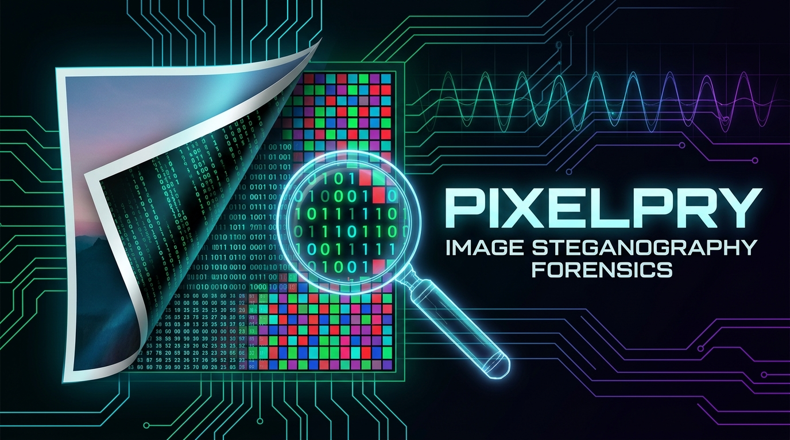

<p align="center">
  
</p>

# PixelPry: Steganography Analysis, Extraction & Forensic Recovery Suite

[](https://www.python.org/)
[](LICENSE)
[]()
[]()

**PixelPry** is a modular digital image steganography forensic analysis, payload extraction, and file repair framework. Designed for security researchers, CTF competitors, and forensic analysts to automatically identify image formats via magic bytes, analyze spatial-domain LSB bitstreams, calculate transform-domain 2D-DCT AC frequency coefficients, integrate Steghide extraction, and repair corrupted image chunk structures.

---

## Table of Contents
- [Key Features](#key-features)
- [Repository Structure](#repository-structure)
- [Installation & Setup](#installation--setup)
- [Usage Guide](#usage-guide)
  - [CLI Mode](#1-cli-mode)
  - [Interactive & Drag-and-Drop Mode](#2-interactive--drag-and-drop-mode)
  - [Building Standalone Windows Executable](#3-building-standalone-windows-executable)
- [BYTE MAIT Task 02: Challenge Writeup](#byte-mait-task-02-challenge-writeup)
- [Forensic Wiki & Reference Suite (`wiki/`)](#forensic-wiki--reference-suite-wiki)
- [Forensic Methodology & Caveats](#forensic-methodology--caveats)
- [License](#license)

---

## Key Features

1. **Format Identification via Magic Bytes (Header Signatures)**
   - Identifies raw file headers directly from byte signatures rather than trusting spoofed extensions:
     - PNG: `\x89PNG\r\n\x1a\n`
     - JPEG: `\xff\xd8\xff`
     - BMP: `BM`
   - Graceful fallback to container inspection for alternative formats.

2. **Spatial-Domain LSB Extraction (Lossless PNG / BMP)**
   - Extracts bitstream sequences from flattened RGB/RGBA channel arrays.
   - Evaluates big-endian 32-bit length prefixes to recover exact-length payloads (supporting images, audio, zip archives, PEM certificates, scripts, JSON, and text).
   - Evaluates sequential ASCII bitstreams with letter-frequency heuristics to eliminate compression noise and identify human-readable messages.

3. **Transform-Domain 2D-DCT Frequency Analysis (JPEG)**
   - Converts JPEG luminance into $8 \times 8$ pixel blocks.
   - Computes 2D Discrete Cosine Transform (`scipy.fftpack.dct`) coefficients.
   - Samples mid-frequency AC coefficient LSBs (mirroring the *jsteg* embedding convention).

4. **Steghide Extraction Integration**
   - Automatically attempts payload decryption and decompression on JPEG and BMP images using Steghide (Rijndael-128 in CBC mode with zlib decompression).

5. **Advanced Binary Chunk Repair & Reconstruction**
   - Reconstructs corrupted PNG headers, solves IHDR CRC checksums to recover tampered dimensions (width/height), strips injected corrupting bytes, and realigns IDAT deflate streams.

---

## Repository Structure

```text
PixelPry/
├── assets/                    # Project branding, icons, and hero banners
│   ├── PixelPry.ico           # Windows application icon
│   └── pixelpry_banner.jpg    # High-resolution project thumbnail & banner
├── ctf_challenges/            # CTF steganography forensics & challenge files
│   ├── challenge.png          # Original corrupted challenge image
│   └── challenge_recovered.png# Solved & restored image revealing the hidden flag banner
├── samples/                   # Curated steganography test corpus
│   ├── ChangeinLSB.jpg
│   ├── Image_hidden_in_an_audio.png
│   ├── Printer_Steganography.jpg
│   ├── Spectrogram_-_Nine_Inch_Nails_-_My_Violent_Heart.png
│   ├── Steganography.png
│   ├── Steganography_original.png
│   ├── Steganography_recovered.png
│   └── Wikipedia_Steganography_Flag.png
├── tests/                     # Verification test vectors & payloads
│   ├── fixtures/              # Cover carriers & multi-format payloads (JSON, PEM, WAV, ZIP, etc.)
│   └── payloads/              # Reference plaintext test messages
├── wiki/                      # Forensic wiki reports & true-format recovered payloads
│   ├── README.md              # Master verification registry
│   ├── challenge_flag.png     # Isolated high-resolution crop of the recovered flag banner
│   ├── challenge_flag.txt     # Verified flag text string
│   └── *.md / *.txt / *.png   # In-depth writeups and extracted payload files
├── PixelPry.py                # Main CLI & Interactive application script
├── PixelPry.spec              # PyInstaller packaging configuration
├── requirements.txt           # Python package dependencies
├── LICENSE                    # MIT Open Source License
├── README.md                  # Master documentation
└── .gitignore                 # Git ignore rules for build caches and binaries
```

---

## Installation & Setup

### Prerequisites
- Python 3.10 or higher
- Optional: `steghide` (for transform-domain encrypted payload extraction)

### Installation
Clone the repository and install the dependencies:
```bash
git clone https://github.com/skshmnarang/PixelPry.git
cd PixelPry
pip install -r requirements.txt
```

---

## Usage Guide

### 1. CLI Mode

#### Basic Analysis
Run PixelPry directly on any target image:
```bash
python PixelPry.py samples/Steganography.png
```

#### Byte-for-Byte Reference Verification
Verify extracted data against a reference secret file:
```bash
python PixelPry.py samples/Wikipedia_Steganography_Flag.png --verify tests/payloads/test1.txt
```

#### Automatically Extract & Save Discovered Payloads
Extract discovered payloads and save them in their native file format:
```bash
python PixelPry.py samples/Steganography_original.png --save output_directory/
```

---

### 2. Interactive & Drag-and-Drop Mode
PixelPry includes a smart terminal runner. If launched without CLI arguments or double-clicked from Windows Explorer:
1. It automatically prompts for the image file path.
2. Supports dragging and dropping an image directly into the terminal window.
3. Keeps the console window open after completion so outputs can be inspected without the window closing immediately.

---

### 3. Building Standalone Windows Executable
You can compile PixelPry into a standalone `.exe` bundled with all Python runtimes and libraries:
```bash
pip install pyinstaller
pyinstaller PixelPry.spec
```
The standalone executable will be output to `dist/PixelPry.exe`.

---

## BYTE MAIT Task 02: Challenge Writeup

### Challenge Overview
- **Track:** Cybersecurity Recruitment — Task 02: Steganography
- **Target:** `challenge.png` (415,143 bytes)
- **Problem Statement:** *"The challenge is a PNG file that has been corrupted. Find the flag in the format BYTE{...}."*
- **Flag Recovered:** `BYTE{g0t_1t_1n_plA1n_s1ght}`

### Forensic Diagnosis & Solution
1. **Initial Execution Failure:**
   Running standard image loaders on `challenge.png` resulted in `cannot identify image file 'challenge.png'` because the file structure was intentionally corrupted.
2. **Anomaly 1 — IHDR Dimension Tampering (Height Truncation):**
   - The file recorded an IHDR CRC of `0xcad1ced6`, but the dimensions in the header were set to $724 \times 800$ (which produces CRC `0x8c3b621c`).
   - Brute-forcing the dimension space matching CRC `0xcad1ced6` revealed the true height is **$850$ pixels**. The author cropped 50 rows to hide the flag banner outside the visible canvas.
3. **Anomaly 2 — Injected Corrupting Bytes:**
   - Exactly 12 extraneous bytes (`6c 0b f0 45 4a 5d 83 1e 0c ff 95 34`) were injected at byte offset `196677` between IDAT chunks 3 and 4, corrupting chunk headers and breaking zlib decompression.
4. **Reconstruction & Flag Extraction:**
   - Stripping the 12 corrupting bytes realigned all subsequent IDAT chunks to valid CRC checksums.
   - Expanding the canvas to $724 \times 850$ pixels revealed the hidden bottom banner:
     $$\mathbf{flag\{g0t\_1t\_1n\_plA1n\_s1ght\}} \longrightarrow \mathbf{BYTE\{g0t\_1t\_1n\_plA1n\_s1ght\}}$$
   - Saved artifacts:
     - Recovered Image: [`ctf_challenges/challenge_recovered.png`](ctf_challenges/challenge_recovered.png)
     - Flag Banner: [`wiki/challenge_flag.png`](wiki/challenge_flag.png)
     - Flag Submission String: [`wiki/challenge_flag.txt`](wiki/challenge_flag.txt)

---

## Forensic Methodology & Caveats

- **Heuristic Boundaries:** A verdict of `None detected` does not prove an image is clean. Non-sequential pixel orderings, custom PRNG seeds, encryption without headers, and exotic color space manipulation require targeted domain tests.
- **Verification Requirement:** Plausible payloads flagged as `LIKELY` must be cross-verified, as high-frequency textures or compression patterns can occasionally mimic ASCII character distributions.
- **Reconstruction Approximation:** JPEG DCT analysis reconstructs coefficients from decoded spatial pixels when raw quantized stream tables are not directly exposed.

---

## License
Distributed under the [MIT License](LICENSE). Copyright (c) 2026 Saksham Narang.
